# IoT Reference Implementation: How to Build an Environment Monitor Solution

This guide demonstrates how existing IoT solutions can be adapted to address more complex problems (e.g., solutions that require more sensor monitoring).
The solution we present here, an Environment Monitor, incorporates additional hardware and extends the use of IoT software libraries (sensors and I/O).
Also, the solution has been adapted so the gateway can work with multiple operating systems.

The Environment Monitor solution described in this how-to guide, shown in Figure 1, is built using an
[Intel® NUC Kit DE3815TYKHE](http://www.intel.com/content/www/us/en/nuc/nuc-kit-de3815tykhe-board-de3815tybe.html),
an Arduino 101\* (branded Genuino 101\* outside the U.S.) board, and Grove\* sensors available from Seeed Studio\*. The solution
runs on Ubuntu\* Server with the [Intel® System Studio IoT Edition](https://software.intel.com/en-us/iot/tools-ide/ide/iss-iot-edition),
which creates the code to enable the sensors.

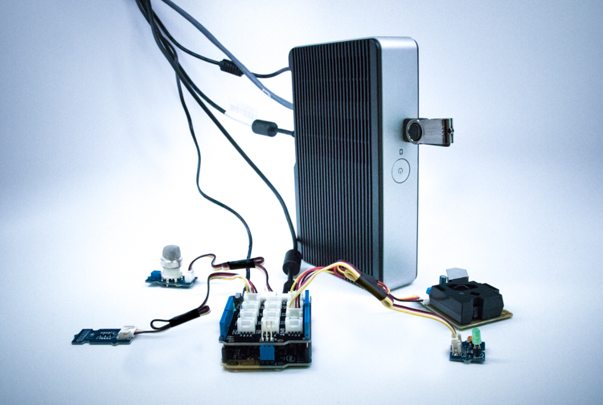

*Figure 1. Adapted Environment Monitor Solution.*

The Intel® NUC acts as a gateway for the solution. The Intel® NUC provides plenty of compute power to function as a router, run higher-level services such as a
Web-server, and to interact with other cloud services (AWS, MQTT, etc.). However it does not provide any I/O ports for interfacing directly with sensors.
Hence, the Arduino 101\* acts an edge device/sensor hub. Firmata\*, a communication protocol, is used to control the Arduino 101\* from the application running on
the Intel® NUC. In turn, the gateway can be programmed using Intel® System Studio IoT Edition from the host computer.

This solution is built around MRAA (I/O library) and UPM (sensor library) from the [Intel® IoT Developer Kit](https://software.intel.com/en-us/iot/hardware/dev-kit)
to interface with platform I/O and sensor data. In this case, the MRAA library provides an abstraction layer for the hardware to enable direct access to I/O on
the Arduino 101\* board using Firmata\*. The UPM sensor library was developed on top of MRAA and exposes a user-friendly API that will allow the user to capture
sensor data with just a few lines of code. Data is then sent periodically to Amazon Web Services (AWS)\* using MQTT\*.

The exercise in this document describes how to build the Environment Monitor solution.

From this exercise, developers will learn how to:
 * **Setup the system hardware**
        * Intel® NUC Kit DE3815TYKHE
        * Arduino 101\* board
        * Sensors
 * **Install and configure the required software**
        * Ubuntu\* Server
        * IoT Software Libraries ([MRAA](http://mraa.io) and [UPM](http://upm.mraa.io)
        * [Intel® System Studio IoT Edision](https://software.intel.com/en-us/iot/tools-ide/ide/iss-iot-edition) (IDE)
 * **Connect to Cloud Services**
        * Amazon Web Services (AWS)\* using MQTT\*

## Setup the System Hardware

This section describes how to set up all the required hardware for the Environment Monitor solution: the Intel® NUC Kit DE3815TYKHE, the Arduino 101\* board,
and Grove\* sensors.

### Intel® NUC Setup

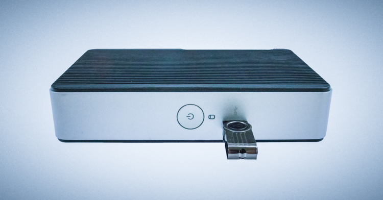

*Figure 2. Intel® NUC with bootable USB*

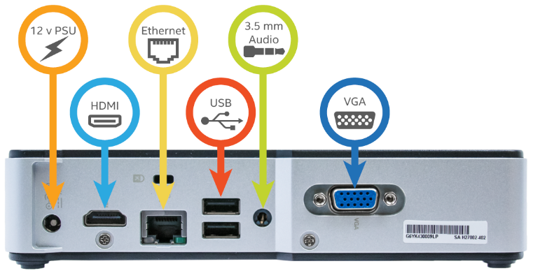

*Figure 3. Back of the Intel® NUC*

Setting up the Intel® NUC for this solution consists of the following steps:
 1. Follow the Intel® NUC DE3815TYKHE User Guide (available online here) and determine if additional components, such as system memory, need to be installed.
 Optionally, an internal drive and/or wireless card can be added.
 2. Connect a monitor via the HDMI or VGA port and a USB keyboard. These are required for OS deployment and can be removed after the Intel® NUC has been
 connected to the network and a connection from the development environment has been established.
 3. Plug in an Ethernet cable from your network’s router. This step can be omitted if a wireless network card has been installed instead.
 4. Plug in the power supply for the Intel® NUC but **DO NOT** press the power button yet. First connect the Arduino 101 and other hardware components and then
 power on the Intel® NUC.

**Note:** The Intel® NUC provides a limited amount of internal eMMC storage (4 GB). Consider using an internal drive or a USB thumb drive to extend the storage capacity.

### Arduino 101\* Setup

In general, the Arduino 101\* board will be ready to use out of the box without any additional changes. A USB Type A to Type B cable is required to connect the
Arduino 101\* to the Intel® NUC.

Additional setup instructions for the Arduino 101\* board are available at https://www.arduino.cc/en/Guide/Arduino101.

### Sensors Setup

The sensors used for this project are listed in Table 1.

First, plug in the Grove\* Base Shield on top of the Arduino 101\* board.

Three sensors with various functions relevant to monitoring the environment have been selected:
 * **Grove\* - Gas Sensor (MQ2)** measures the concentration of several gases (CO, CH4, propane, butane, alcohol vapors, hydrogen, liquefied petroleum gas) and
 is connected to analog pin 1 (A0). Can detect hazardous levels of gas concentration.
 * **Grove\* - Dust Sensor** will detect fine and coarse particulate matter in the surrounding air, connect to digital pin 4 (D4).
 * **Grove\* - Temperature, Humidity & Barometer Sensor** is based on the Bosch\* BME280 chip and used to monitor temperature and humidity. It can be plugged in
any of the connectors labeled I2C on the shield.

The **Grove\* Green LED** acts as an indicator LED to show whether the application is running or not, and is connected to digital pin 2 (D2).

Table 1. Bill of Materials

|         | Component | Details  | Pin Connection | Connection Type |
|---------|-----------|----------|----------------|-----------------|
|Base System| [Intel® NUC Kit DE3815TYKHE](http://ark.intel.com/products/78577/Intel-NUC-Kit-DE3815TYKHE) | Gateway |||
|| [Arduino 101\*](https://www.arduino.cc/en/Main/ArduinoBoard101) | Sensor Hub || USB |
|| [Grove\* - Base Shield](https://www.seeedstudio.com/Base-Shield-V2-p-1378.html) | Arduino 101\* Shield || Shield |
|| USB Type A to Type B Cable | Connect Arduino 101\* board to Intel® NUC |||
| Sensors | [Grove\* - LED Sensor](https://www.seeedstudio.com/Grove-Green-LED-p-1144.html) | LED indicates status of the monitor | D2 | Digital |
|| [Grove\* - Relay](https://www.seeedstudio.com/Grove-Relay-p-769.html) | Fan control | D8 |
|| [Grove\* - Gas Sensor(MQ2)](https://www.seeedstudio.com/Grove-Gas-Sensor(MQ2)-p-937.html) | Gas sensor (CO, methane, smoke, etc.) | A1 | Analog |
|| [Grove\* - Dust Sensor](https://www.seeedstudio.com/Grove-Dust-Sensor-p-1050.html) | Particulate matter sensor | D4 | Digital |
|| [Grove\* - Temp&Humi&Barometer Sensor (BME280)](https://www.seeedstudio.com/Grove---Temp%26amp%3BHumi%26amp%3BBarometer-Sensor-(BME280)-p-2653.html) | Temperature, humidity, barometer sensor | I2C Bus | I2C |

**Note:** here a green LED is used but any color LED (red, blue, etc.) can be used as an indicator.

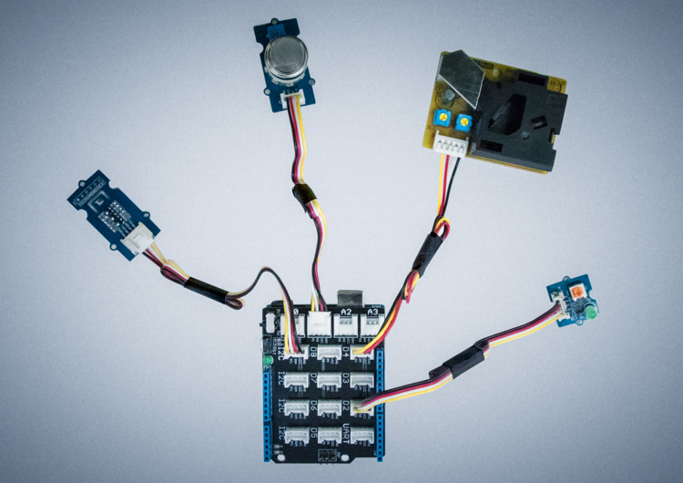

*Figure 4. Sensor connections to the Arduino 101\*

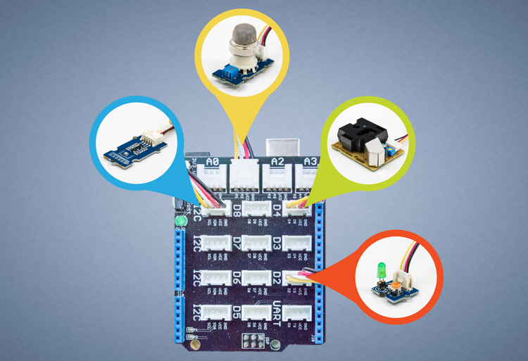

*Figure 5. Sensors and pin connections*

## Install and Configure the Required Software

This section gives instructions for installation of the operating system and connecting the Intel® NUC to the Internet, installing required software libraries,
and finally cloning the project sources from a GitHub\* repository.

### Installing the OS: Ubuntu Server

 * Installation instructions for Ubuntu on the Intel® NUC are available here: https://www.ubuntu.com/download/server/install-ubuntu-server.

   Use the ISO file from the above link.

 * Instead of creating a bootable CD-ROM (as per the above link), create a bootable USB stick. The instructions to download the tool and create the bootable
 USB based on your OS are here:
    * Windows®: https://www.ubuntu.com/download/desktop/create-a-usb-stick-on-windows
    * Ubuntu\*: https://www.ubuntu.com/download/desktop/create-a-usb-stick-on-ubuntu
    * Mac OS\*: https://www.ubuntu.com/download/desktop/create-a-usb-stick-on-macos

 * Once the bootable USB drive is ready, proceed to insert it into one of the USB ports on the Intel® NUC and start it up. Once it starts it should display a
 menu where you can choose to install Ubuntu. Follow all the steps while Ubuntu is installed. For ease of use later on, please select to install ssh server when
 prompted during the Ubuntu installation.

**Note:** Supporting information including drivers and troubleshooting is available at http://www.intel.com/content/www/us/en/support/boards-and-kits/000005499.html.

### Connecting the Intel® NUC to the Internet

This section describes how to connect the Intel® NUC to your network, which will enable you to deploy and run the project from a different host on the same network
(i.e. your laptop). Internet access is required in order to download the additional software libraries and the project code.

The following steps list commands that have to be entered into a terminal (shell) on the Intel® NUC.

#### Ethernet

 1. Once Ubuntu is installed, restart the Intel® NUC and login using your user.
 2. Type in the command `ifconfig` and find the interface named `enp3s0` in the list. In some cases, this might show up as `eth0` instead.
 Use the name displayed here for the following step.
 3. Open the network interface file using the command: `vim /etc/network/interfaces` and the following lines to it:

    ```
    auto enp3s0
    iface enp3s0 inet dhcp
    ```

 4. Save and exit the file and restart the network service using the following command: `/etc/init.d/networking restart`.
 5. If you are connecting to external networks via a proxy, you will have to set it up as well.

#### Wi-Fi (optional)

This is an optional step that only applies if a wireless card has been added to the Intel® NUC.

 1. Install Network Manager using the command: `sudo apt install network-manager` and then install WPA supplicant using: `sudo apt install wpasupplicant`
 2. Once these are in place, check your WiFi\* interface name using `ifconfig`. This examples uses `wlp2s0`. Now run the following commands:
    * Add the wifi interface to the interfaces file at: `/etc/network/interfaces` by adding the following lines:

        ```
        auto wlp2s0
        iface wlp2s0 inet dhcp
        ```

    * Now restart the networking service: `/etc/init.d/networking restart`
    * Now run: `nmcli networking` and `nmcli n connectivity` and `nmcli radio`, these commands tell you whether the network is actually enabled or not, in case
    either of them says not enabled then you’ll have to enable full connectivity. For enabling radio use the following command: `nmcli radio wifi on`
    * Now check the connection status: `nmcli device status`
    * If the wifi interface shows up as unmanaged then you might have to troubleshoot that.
    * Now to see and add wifi connections:

        ```
        nmcli d wifi rescan
        nmcli d wifi
        nmcli c add type wifi con-name [network-name] ifname [interface-name] ssid [network-ssid]
        ```

    * Now, running `nmcli c` should show you the connection you have tried to connect to. In case you are trying to connect to an enterprise network, you might
    have to make changes to `/etc/NetworkManager/system-connections/[network-name]`
    * Now bring up the connection and the network interfaces:

        ```
        nmcli con up [network-name]
        ifdown wlp2s0
        ifup wlp2s0
        ```

You can now use the Intel® NUC remotely from your development machine if you are on the same network.

### Installing the MRAA and UPM libraries

In order to put UPM and MRAA on your system you can just use the MRAA:PPA to update the libraries. The instructions are as follows:

```
sudo add-apt-repository ppa:mraa/mraa
sudo apt-get update
sudo apt-get install libupm-dev python-upm python3-upm upm-examples libmraa1 mraa-firmata-fw mraa-imraa
```

You can also build from source:

MRAA instructions: https://github.com/intel-iot-devkit/mraa/blob/master/docs/building.md
UPM instructions: https://github.com/intel-iot-devkit/upm/blob/master/docs/building.md

**Note:** You’ll need CMake if you plan to build from source.

Plug in an Arduino 101\* board and reboot the Intel® NUC. The Firmata\* sketch is flashed onto Arduino 101\*, and you are now ready to use MRAA and UPM with it.
However, if you face any problems with it then run the command `imraa –a`. If you are missing `dfu-util` then install it after setting the MRAA PPA so that
you get the dfu that comes with MRAA.

### Cloning the Git\* repository

Clone the path to product repository with Git\* on your development computer as follows:

```
git clone https://github.com/intel-iot-devkit/reference-implementation.git
```

Alternatively, you can download the repository as a .zip file. To do so, from your web browser (make sure you are signed in to your GitHub account) go to and
click the **Clone or download** button on the far right (green button in figure 6 below). Once the .zip file is downloaded, unzip it, and then use the files in the
directory for this example.

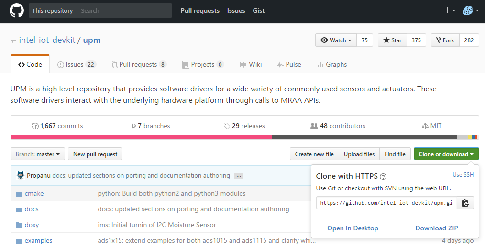

*Figure 6. Cloning or downloading a Github repository.*

## Create the Development and Runtime Environment

This section gives instructions for setting up the rest of the computing environment needed to support the Environment Monitor solution, including installation
of Intel® System Studio IoT Edition, creating a project, and populating it with the files needed to build the solution.

### Install Intel® System Studio IoT Edition

Intel® System Studio IoT Edition is a plug-in for the Eclipse\* IDE that allows you to connect to, update, and program IoT projects on the Intel® NUC.

#### Windows Installation

**Note:** Some files in the archive have extended paths. We recommend using 7-Zip\*, which supports extended path names, to extract the installer files.

 1. Install 7-Zip (Windows only):
    a. Download the 7-Zip software from http://www.7-zip.org/download.html.
    b. Right-click on the downloaded executable and select Run as administrator.
    c. Click Next and follow the instructions in the installation wizard to install the application.
 2. Download the Intel® System Studio IoT Edition installer file for Windows.
 3. Using 7-Zip, extract the installer file.

**Warning:** Be sure to extract the installer file to a folder location that does not include any spaces in the path name. For example, the folder
**C:\My Documents\ISS** will not work, while **C:\Documents\ISS** will.

#### Linux Installation

 1. Download the Intel® System Studio IoT Edition installer file for Linux.
 2. Open a new Terminal window.
 3. Navigate to the directory that contains the installer file.
 4. Enter the command: `tar -jxvf file` to extract the **tar.bz2** file, where `file` is the name of the installer file. For example,
 `tar -jxvf iss-iot-linux.tar.bz2`. The command to enter may vary slightly depending on the name of your installer file.

#### Mac OS X® Installation

 1. Download the Intel® System Studio IoT Edition installer file for Mac OS X.
 2. Open a new Terminal window.
 3. Navigate to the directory that contains the installer file.
 4. Enter the command: `tar -jxvf file` to extract the **tar.bz2** file, where `file` is the name of the installer file. For example,
 `tar -jxvf iss-iot-mac.tar.bz2`. The command to enter may vary slightly depending on the name of your installer file.

**Note:** If you see a message that says "iss-iot-launcher can’t be opened because it is from an unidentified developer", right-click the
file and select **Open with**. Select the **Terminal** app. In the dialog box that opens, click **Open**.

### Launch Intel® System Studio IoT Edition

 1. Navigate to the directory you extracted the contents of the installer file to.
 2. Launch Intel® System Studio IoT Edition:
    * On Windows®, double-click **iss-iot-launcher.bat** to launch Intel® System Studio IoT Edition.
    * On Linux\*, run export SWT_GTK3=0 and then ./iss-iot-launcher.sh.
    * On Mac OS X\*, run iss-iot-launcher.

**Note:** Using the *iss-iot-launcher* file (instead of the Intel System Studio IoT Edition executable) will launch Intel System Studio IoT Edition with all the
necessary environment settings. Use the *iss-iot-launcher* file to launch Intel System Studio IoT Edition every time.

### Add the Solution to Intel® System Studio IoT Edition

This section gives the steps to add the solution to Intel® System Studio IoT Edition, including creating a project and populating it with the files needed to
build and run.
 1. Open Intel® System Studio IoT Edition. It will start by asking for a workspace directory; choose one and then click **OK**.
 2. From the Intel® System Studio IoT Edition, select **File | New | Create a new Intel Project for IoT**. Then choose **Intel® Gateway 64-Bit**, as shown in
 Figure 7 and click next until you reach the **Create or select the SSH target connection** screen, as shown in Figure 8. Input details here of the IP address
 of the Intel® NUC (run command: `ifconfig` on the Intel® NUC if you’re unsure).

    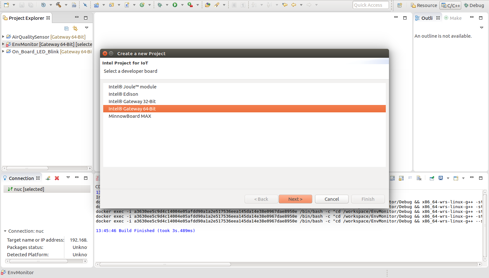

    *Figure 7. New Intel® IoT Project.*

    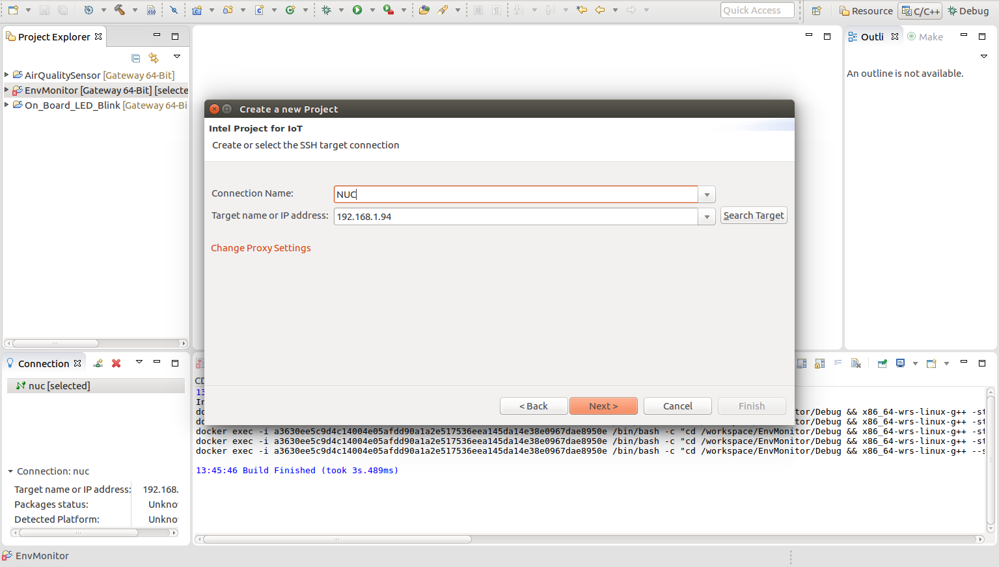

    *Figure 8. Adding Target Connection.*

 3. Now give the project the name “Environment Monitor” and in the examples choose the “Air Quality Sensor” as the How-To Code Sample (shown in Figure 9) and
 then click **Next**.

    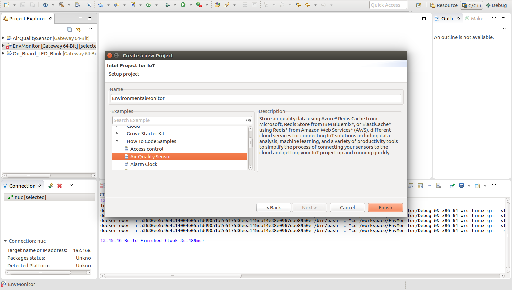

    *Figure 9. Adding Project Name.*

 4. The preceding steps will have created a How to Code Sample project. Now we have to do a couple of small things in order to convert this into Environment
 Monitor Project:
    a. Copy over the **air-quality-sensor.cpp** and **grovekit.hpp** file from the git repository's **src** folder into the new project's **src** folder in
    Intel® System Studio IoT Edition. This will overwrite the local files.
    b. Next right click on the project name and follow the sequence: **Right Click → C/C++ Build → Settings → IoT WRS 64-Bit G++ Linker → Libraries** and then
    add the libraries as shown in the following screen shot. This can be done by clicking on the small green '+' icon on the top right side of the libraries
    view. The red 'x' next to green '+' icon deletes the libraries.

    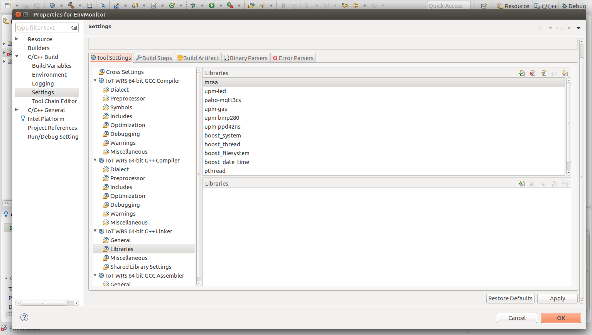

    *Figure 10. Adding libraries to the build path.*

 5. In order to run this project, connect to the Intel® NUC first using the IP address already provided. This can be done from the **Target Selection View**,
 but you can also right click on the target and choose the “Connect” option. Enter username/password for the Intel® NUC when prompted.

**Note:** Ensure the Intel® NUC and the laptop (running Intel® System Studio IoT Edition) are connected to the same network.

## Setup and Connect to the Cloud Data Store

### Amazon\* AWS

This solution was designed to send sensor data using the MQTT\* protocol to Amazon\* AWS. In order to connect the application to the online data store, first
setup and create an account.

To set up and create an account: https://github.com/intel-iot-devkit/intel-iot-examples-mqtt/blob/master/aws-mqtt.md

The following information should now be available:
 * `MQTT_SERVER` - use the host value you obtained by running the `aws iot describe-endpoint` command, along with the `ssl://` (for C++) or `mqtts://` protocol (for JavaScript\*)
 * `MQTT_CLIENTID` - use `\<Your device name\>`
 * `MQTT_TOPIC` - use devices`/\<Your device name\>`
 * `MQTT_CERT` - use the filename of the device certificate as described above
 * `MQTT_KEY` - use the filename of the device key as described above
 * `MQTT_CA` - use the filename of the CA certificate (`/etc/ssl/certs/VeriSign_Class_3_Public_Primary_Certification_Authority_-_G5.pem`)

### Additional Setup for C++ Projects

 1. When running your C++ code on the Intel® NUC, set the MQTT\* client parameters in Eclipse\* as outlines in the steps below: Go to Run configurations and, in
 the Commands to execute before application field, type the following:

     ```
     chmod 755 /tmp/<Your app name>; export MQTT_SERVER="ssl://<Your host name>:8883"; export MQTT_CLIENTID="<Your device ID>"; export MQTT_CERT="/home/root/.ssh/cert.pem"; export MQTT_KEY="/home/root/.ssh/privateKey.pem"; export MQTT_CA="/etc/ssl/certs/VeriSign_Class_3_Public_Primary_Certification_Authority_-_G5.pem"; export MQTT_TOPIC="devices/<Your device ID>"
     ```

 2. Click the Apply button to save these settings.
 3. Click the Run button to run the code on your board.

    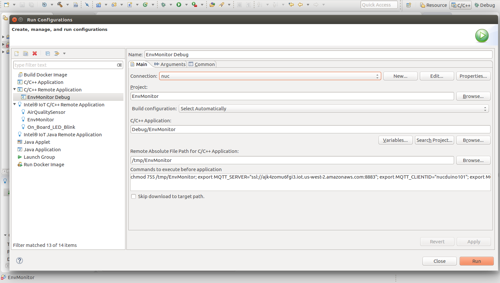

    *Figure 11. Adding MQTT variables to a Run Configuration*

As this how-to reference implementation demonstrates, IoT developers can build solutions at relatively low cost and without specialized skill sets. Using an Intel®
NUC combined with an Arduino 101\* board and sensors, project teams can rapidly adapt existing IoT solutions to address novel business needs.

## More Information

 * [IoT Reference Implementation: Making of an Evironment Monitor Solution](https://software.intel.com/en-us/articles/iot-reference-implementation-making-of-an-environment-monitor-solution)
 * [Code Sample - Air Quality Sensor In Java\*](https://software.intel.com/en-us/articles/air-quality-sensor-in-java)
 * [Code Sample - Air quality sensor in C++](https://software.intel.com/en-us/articles/how-to-intel-iot-code-samples-air-quality-sensor-in-cpp)
